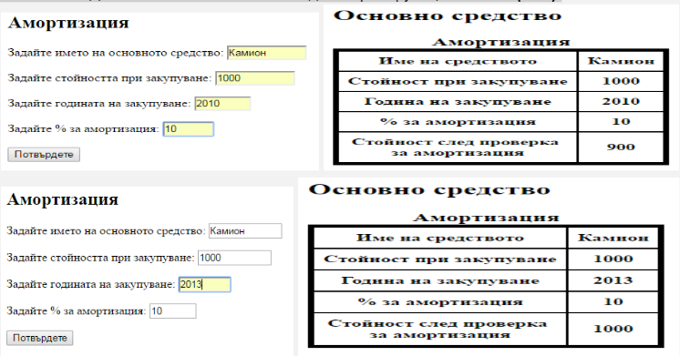

# depreciation-php
Да се състави приложение за:
 Въвеждане на четири величини: име на основно средство, стойността при закупуването му, година на закупуване и процент за амортизация. 
 Да се изведат всички начални данни.
 Да се провери дали изминалият брой години спрямо текущата година е:
 1. >= 5 , тогава стойността се понижава с дадения процент и се извежда новата стойност.
 2. < 5 , тогава стойността не се променя и се извежда отново началната стойност.
 Забележка: Да се изтегли системната година чрез функцията date("Y").

